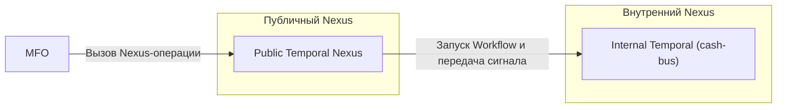
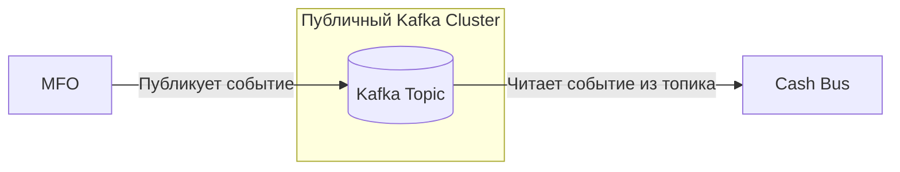
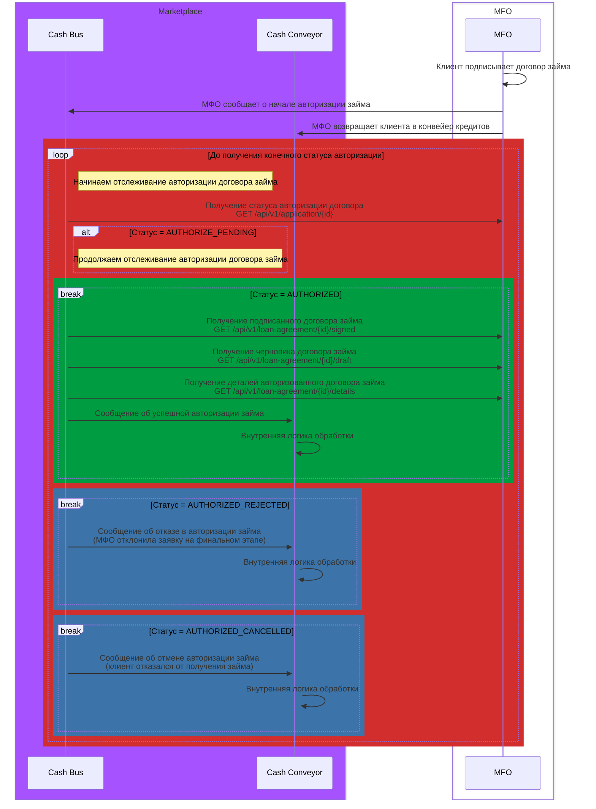

# Документация абстрактного API МФО

Данный документ описывает целевой процесс получения кредита наличными.

Ниже представлены workflow-процессы и описание API.

## Глоссарий

| Название сервиса | Описание                                                                            |
|------------------|-------------------------------------------------------------------------------------|
| Marketplace      | Оператор финансовой платформы                                                       |
| Cash Bus         | Шина взаимодействия с финансовыми организациями, предоставляющими кредиты наличными |
| Cash Conveyor    | Конвейер кредитов наличными, являющийся точкой входа для оформления кредита         |
| MFO              | Микрофинансовая организация, предоставляющая кредиты наличными                      |

---

# Возможные способы доставки событий

> **ВНИМАНИЕ! Все способы доставки событий доступны исключительно через VPN-туннель между Marketplace и инфраструктурой партнера.**

## Защитные механизмы

Реализация endpoint `GET /api/v1/application/{id}` является обязательной для всех вариантов интеграции.
Cash Bus использует данный endpoint в качестве резервного механизма получения статуса заявки. 
При недоступности основного канала доставки событий система автоматически переключается на периодический опрос (polling) для синхронизации состояния заявки. 
Если ни один из способов доставки событий не реализован, Cash Bus будет использовать исключительно polling-модель взаимодействия через endpoint `GET /api/v1/application/{id}`. 
При использовании только polling-модели необходимо учитывать, что синхронизация статусов происходит с задержкой, зависящей от настроек интервала опроса. В результате возможны временные расхождения между статусом заявки в системе партнера и в Marketplace. Например, заявка уже может быть авторизована в системе МФО, тогда как в Marketplace ее статус еще не обновлен.

---

## Temporal Nexus

> **ВНИМАНИЕ! Приоритетный и рекомендуемый способ доставки событий.**

- [Что такое Temporal?](https://docs.temporal.io/temporal)
- [Что такое Temporal Nexus?](https://docs.temporal.io/nexus)

Marketplace предоставляет партнеру доступ к выделенному Nexus Endpoint в Temporal. 
Партнерская система инициирует вызов Nexus-операции, после чего событие маршрутизируется во внутренний контур и запускает соответствующий Workflow в системе Cash Bus. 
Такой подход обеспечивает надежную доставку событий, встроенные механизмы повторных попыток, трассировку выполнения и централизованное управление бизнес-процессами.

### Схема взаимодействия

---

## Kafka

Marketplace предоставляет партнеру доступ к Kafka-кластеру и выделенному топику для публикации событий. 
Партнерская система самостоятельно публикует события в указанный топик, после чего сервис Cash Bus считывает их и выполняет дальнейшую обработку.

### Схема взаимодействия

---

# Описание Workflow

## Workflow авторизации договора займа

