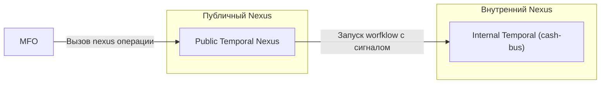
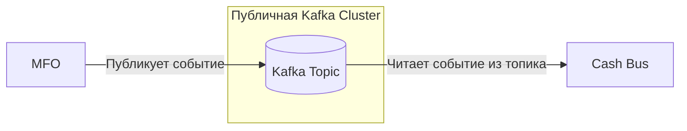
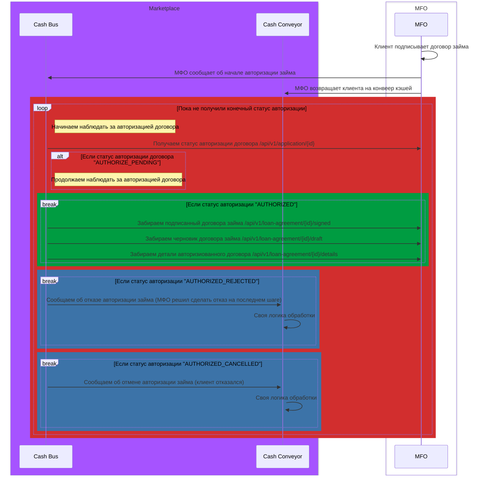

# Документация Абстрактного API МФО

Данный документ описывает желаемый процесс получение кредита наличными.
Ниже представлен workflow процессы и сам api.

#### Глосарий

| Название сервиса | Описание                                                                   |
|------------------|----------------------------------------------------------------------------|
| Cash Bus         | Шина для работы с фин.организациями, которые предоставляют кредит наличных |
| Cash Conveyor    | Ковеер кредита наличных, точка входа для взятие кредита                    |
| MFO              | Микрофинаносвая организация, которая предоставляет кредит наличных         |   

## Возможные транспорты доставки событий

**ВНИМАНИЕ! ВСЕ Доступные транспорты доступны ТОЛЬКО через VPN тунель!**

### Temporal Nexus

**ВНИМАНИЕ! ПРИОРИТЕТНЫЙ И ЖЕЛАЕМЫЙ метод доставки, событий**

- [Что такое Temporal?](https://docs.temporal.io/temporal)
- [Что такое Temporal Nexus?](https://docs.temporal.io/nexus)

Marketplace предоставляет партнеру доступ к выделенному Nexus Endpoint в Temporal. 
Партнерская система инициирует вызов Nexus-операции, после чего событие маршрутизируется во внутренний контур и запускает соответствующий Workflow в системе Cash Bus.
 
Такой подход обеспечивает надежную доставку событий, встроенные механизмы повторных попыток, трассировку выполнения и централизованное управление процессами.

#### Cхема взаимодействия

### Kafka

Marketplace предоставляет партнеру доступ к Kafka-кластеру и выделенному топику для публикации событий. 
Партнерская система самостоятельно публикует события в указанный топик, после чего сервис Cash Bus считывает их и выполняет дальнейшую обработку.

#### Cхема взаимодействия

## Описание Workflows

### Workflow авторизации договора займа

