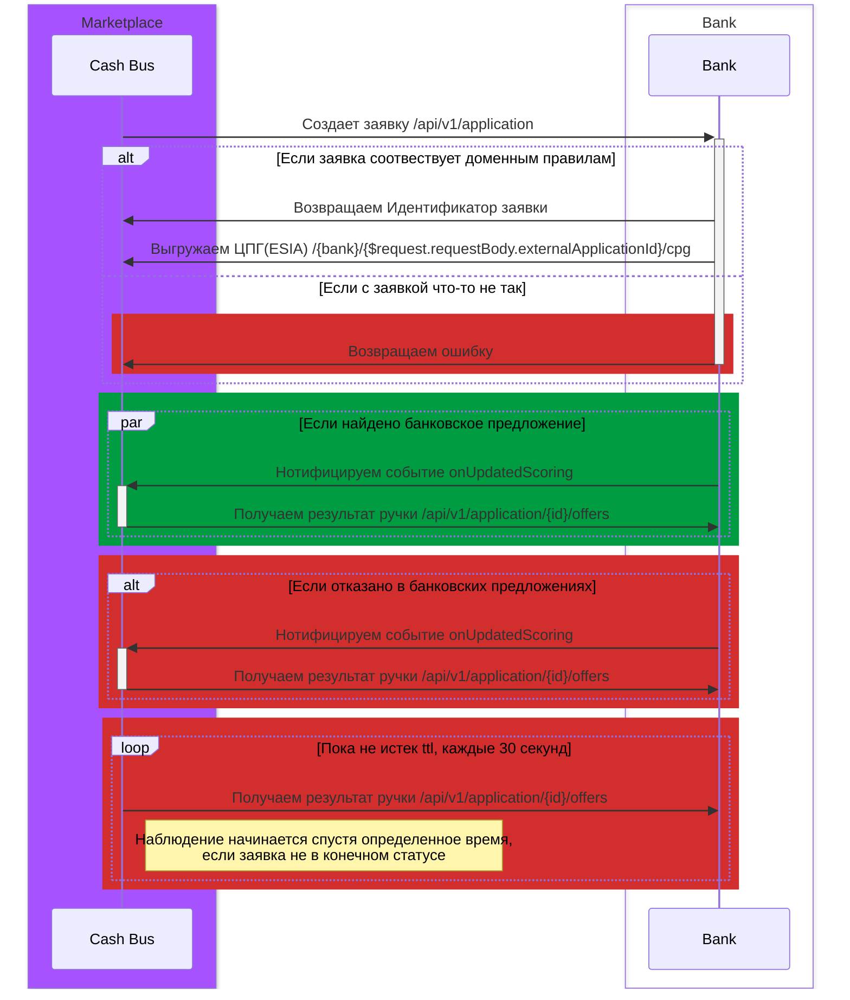
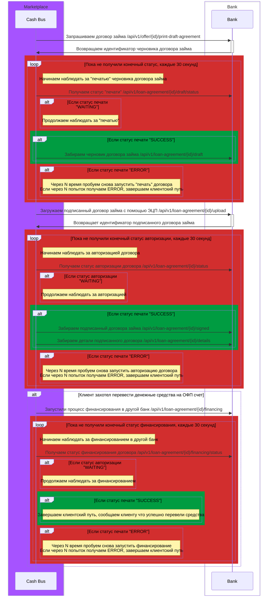

# Документация Абстрактного api банка

Данный документ описывает желаемый процесс получение кредита наличными.
Ниже представлен workflow процессы и сам api. 

## Workflow скоринга

## Workflow авторизации договора займа

